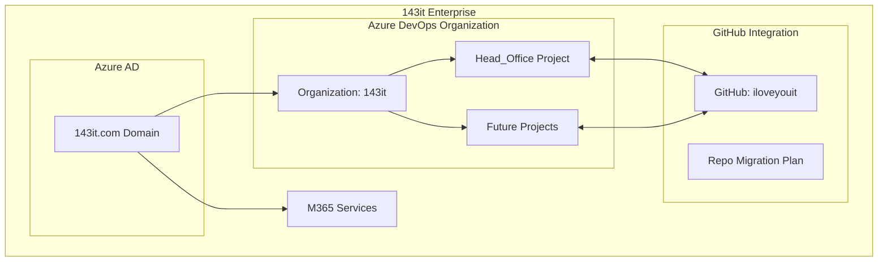

# Azure DevOps Enterprise Architecture Plan for 143it

## Current State Summary

| Component           | Current State                                  |
| ------------------- | ---------------------------------------------- |
| **Azure AD / M365** | Active under 143it.com                         |
| **Azure DevOps**    | Organization exists, needs restructuring       |
| **GitHub**          | Exists under github.com/iloveyouit (NOT 143it) |
| **Primary Project** | Head_Office (gold standard)                    |
| **Teams**           | Development, QA, Operations, Management        |

## Architecture Overview

## Key Architecture Decisions

### 1. Azure DevOps Organization Structure

- **Organization Name**: 143it (aligned with 143it.com domain)
- **Default Collection**: DefaultCollection
- **Parent Company**: 143it

### 2. Project Structure

- **Head_Office Project**: Gold standard implementation
  - Agile process with Scrum template
  - Sprint-based planning
  - Comprehensive work items and tasks
  - Kanban boards for workflow visualization
  - Git-based repositories
  - Local Developer Experience (Dev Containers / Codespaces for standardized dev environments)

### 3. Team Structure

| Team        | Purpose                      | Access Level  |
| ----------- | ---------------------------- | ------------- |
| Development | Code development, PR reviews | Contributor   |
| QA          | Testing, quality assurance   | Contributor   |
| Operations  | Deployment, infrastructure   | Contributor   |
| Management  | Sprint planning, reporting   | Project Admin |

### 4. GitHub Integration Strategy

- Connect existing github.com/iloveyouit organization
- Option to migrate/rename to 143it organization
- Configure Azure Pipelines with GitHub repos
- Set up webhooks and branch policies

### 5. DevOps Pipeline Components

- Azure Boards (Work items, sprints, Kanban)
- Azure Repos (Git repositories)
- Azure Pipelines (CI/CD)
- Azure Test Plans (Testing)
- Azure Artifacts (Package management)
- Infrastructure as Code (Terraform/Bicep) for environment provisioning
- Immutable artifact promotion ("Build once, deploy many" strategy)

## Implementation Phases

### Phase 1: Foundation

1. Configure Azure DevOps Organization settings
2. Set up Head_Office project with Agile/Scrum
3. Create team structure
4. Configure Azure AD integration

### Phase 2: Work Item Configuration

1. Define work item types (Epic, Feature, User Story, Task, Bug)
2. Configure sprint cadence
3. Set up backlogs
4. Create custom fields if needed

### Phase 3: Repository Setup

1. Create Git repositories in Azure Repos
2. OR connect existing GitHub repositories
3. Configure branch policies
4. Set up PR templates

### Phase 4: Pipeline Configuration

1. Create CI/CD pipelines
2. Configure build and release workflows
3. Set up deployment environments
4. Configure approvals and gates

### Phase 5: Kanban & Workflow

1. Configure Kanban boards
2. Set up WIP limits
3. Configure swimlanes
4. Create dashboard widgets
