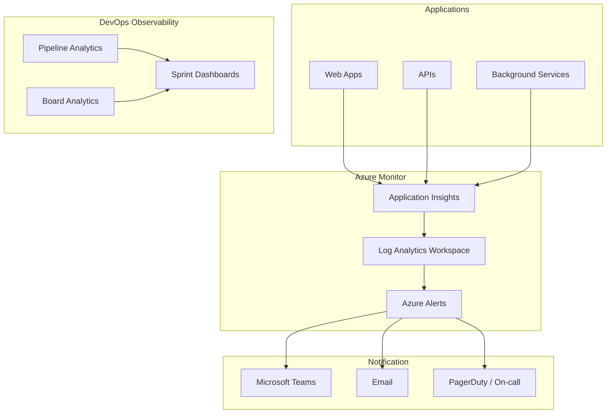

# Monitoring & Observability Plan — 143it Azure DevOps

## 1. Monitoring Architecture

## 2. Application Monitoring

### Application Insights Configuration

| Setting                | Value                                    |
| ---------------------- | ---------------------------------------- |
| **Sampling Rate**      | 100% in Dev/Staging, 25% in Production   |
| **Retention**          | 90 days (raw), 13 months (aggregated)    |
| **Smart Detection**    | Enabled                                  |
| **Availability Tests** | Ping test every 5 minutes from 3 regions |

### Key Metrics to Track

| Metric              | Target    | Alert Threshold   |
| ------------------- | --------- | ----------------- |
| Response time (p95) | ≤ 200ms   | > 500ms for 5 min |
| Error rate          | < 1%      | > 5% for 5 min    |
| Availability        | ≥ 99.9%   | < 99.5% in 15 min |
| CPU usage           | < 70% avg | > 90% for 10 min  |
| Memory usage        | < 80% avg | > 90% for 10 min  |

## 3. DevOps Pipeline Monitoring

### Pipeline Health

| Metric               | Where to Track     | Alert On               |
| -------------------- | ------------------ | ---------------------- |
| Build success rate   | Pipeline Analytics | < 90% over 7 days      |
| Build duration trend | Pipeline Analytics | > 50% increase         |
| Failed deployments   | Release Analytics  | Any production failure |
| Queue time           | Agent pool metrics | > 10 min average       |

### Dashboard Widgets (Azure DevOps)

- [ ] Build success rate (last 30 days)
- [ ] Deployment frequency chart
- [ ] Release pipeline status
- [ ] Test pass rate trend
- [ ] Code coverage trend

## 4. Alerting Strategy

### Severity Levels

| Severity             | Response Time     | Channel                   | Example                      |
| -------------------- | ----------------- | ------------------------- | ---------------------------- |
| **Sev 0 — Outage**   | 15 minutes        | PagerDuty + Teams + Phone | Production down              |
| **Sev 1 — Critical** | 1 hour            | Teams + Email             | Error rate spike > 10%       |
| **Sev 2 — Warning**  | 4 hours           | Teams                     | Elevated response times      |
| **Sev 3 — Info**     | Next business day | Email digest              | Build failures, low severity |

### Alert Rules

- [ ] Configure Azure Monitor action groups per severity
- [ ] Set up Teams channel: `#alerts-production`
- [ ] Set up Teams channel: `#alerts-devops`
- [ ] Configure escalation policy (Sev 0 → on-call → manager after 30 min)

## 5. Incident Response

### Workflow

1. **Detect** → Alert fires → On-call engineer notified
2. **Triage** → Assess severity, create Azure DevOps Bug (Sev-1/0)
3. **Mitigate** → Apply hotfix or rollback deployment
4. **Resolve** → Root cause identified, permanent fix deployed
5. **Review** → Post-incident review within 48 hours, update runbooks

### Post-Incident Review Template

- What happened?
- Timeline of events
- Root cause analysis (5 Whys)
- What went well?
- What could be improved?
- Action items (linked to Azure DevOps work items)

## 6. Log Management

| Source                    | Destination        | Retention |
| ------------------------- | ------------------ | --------- |
| Application logs          | Log Analytics      | 90 days   |
| Infrastructure logs       | Log Analytics      | 30 days   |
| Audit logs (Azure DevOps) | Log Analytics      | 1 year    |
| Security logs             | Microsoft Sentinel | 2 years   |

## 7. Roles & Responsibilities

| Role                 | Monitoring Responsibility                      |
| -------------------- | ---------------------------------------------- |
| **Operations Team**  | Maintain monitoring infra, respond to Sev 0–1  |
| **Development Team** | Instrument code, respond to application alerts |
| **QA Team**          | Monitor test pipeline health                   |
| **Management**       | Review monthly health reports                  |

## 8. FinOps & Cost Management

| Resource            | Alert / Monitoring Activity                   | Owner      |
| ------------------- | --------------------------------------------- | ---------- |
| **Azure Pipelines** | Monitor MS-hosted parallel job consumption    | Operations |
| **Azure Artifacts** | Alert when approaching storage limit quotas   | Operations |
| **User Licenses**   | Audit Basic vs Stakeholder usage monthly      | Management |
| **GitHub Access**   | Monitor active GitHub Advanced Security seats | Management |
