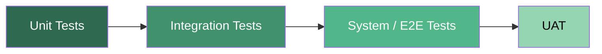
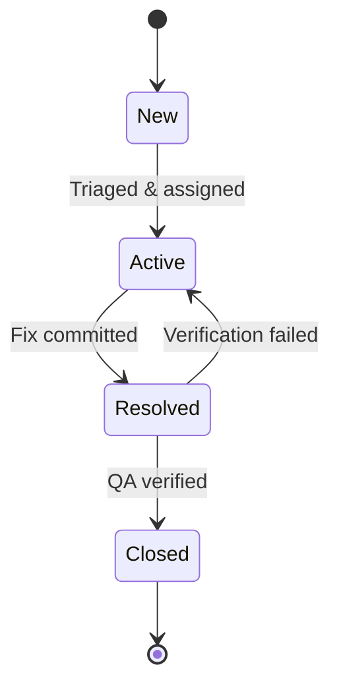

# Testing Strategy — 143it Azure DevOps

## 1. Test Levels



| Level            | Scope                               | Owner           | Tools                         | Gate                    |
| ---------------- | ----------------------------------- | --------------- | ----------------------------- | ----------------------- |
| **Unit**         | Individual functions/classes        | Developers      | xUnit, Jest, pytest           | ≥ 80% coverage          |
| **Integration**  | API contracts, service interactions | Developers + QA | Postman, REST Assured         | All endpoints pass      |
| **System / E2E** | Full workflows end-to-end           | QA Team         | Selenium, Playwright, Cypress | All critical paths pass |
| **UAT**          | Business acceptance                 | Stakeholders    | Manual + recorded scripts     | Sign-off from PO        |

## 2. Test Management in Azure DevOps

### Test Plans

- One **Test Plan** per sprint (linked to sprint iteration)
- Test Suites organized by feature area
- Each test case linked to its parent User Story

### Test Case Lifecycle

1. **Design** → QA writes test cases during sprint planning
2. **Review** → Dev team reviews for coverage gaps
3. **Execute** → Run during sprint, record pass/fail
4. **Automate** → Convert manual cases to automated over time

### Configuration

- [ ] Enable Azure Test Plans for Head_Office project
- [ ] Create test plan template
- [ ] Configure test environments (Dev, Staging)
- [ ] Set up test configurations (browser matrix, OS matrix)

## 3. Automated Testing in Pipelines

### CI Pipeline (on every PR)

```yaml
stages:
  - stage: Build
    jobs:
      - job: BuildAndTest
        steps:
          - script: dotnet build
          - script: dotnet test --collect:"XPlat Code Coverage"
          - task: PublishCodeCoverageResults@1
            inputs:
              codeCoverageTool: Cobertura
              summaryFileLocation: "**/coverage.cobertura.xml"
```

### Quality Gates

| Gate              | Threshold           | Enforcement         |
| ----------------- | ------------------- | ------------------- |
| Code coverage     | ≥ 80%               | PR build must pass  |
| Unit tests        | 100% pass           | PR build must pass  |
| Integration tests | 100% pass           | Pre-deployment gate |
| Security scan     | 0 critical / 0 high | Release gate        |

### CD Pipeline (pre-deployment)

- Run integration test suite against Staging environment
- Run smoke tests after deployment to each environment
- Run E2E suite against Staging before Production promotion

## 4. Non-Functional Testing

| Type              | Frequency   | Tool                                | Criteria                   |
| ----------------- | ----------- | ----------------------------------- | -------------------------- |
| **Performance**   | Per release | Azure Load Testing / k6             | ≤ 200ms p95 response       |
| **Security**      | Per sprint  | OWASP ZAP, GitHub Advanced Security | 0 critical findings        |
| **Accessibility** | Per release | axe, Lighthouse                     | WCAG 2.1 AA compliance     |
| **Load**          | Quarterly   | Azure Load Testing                  | Handle 2× expected traffic |

## 5. Bug Workflow



- **Severity levels**: 1-Critical, 2-High, 3-Medium, 4-Low
- **SLA**: Sev-1 fixed within 4 hours, Sev-2 within 1 sprint
- **Definition of Done**: Bug has regression test, PR reviewed, deployed to Staging, QA-verified

## 6. Roles & Responsibilities

| Role           | Testing Responsibility                                    |
| -------------- | --------------------------------------------------------- |
| **Developers** | Write unit + integration tests, fix bugs                  |
| **QA Team**    | Design test cases, run E2E/manual tests, verify bug fixes |
| **Operations** | Maintain test environments, run load tests                |
| **Management** | Review quality dashboards, approve releases               |
